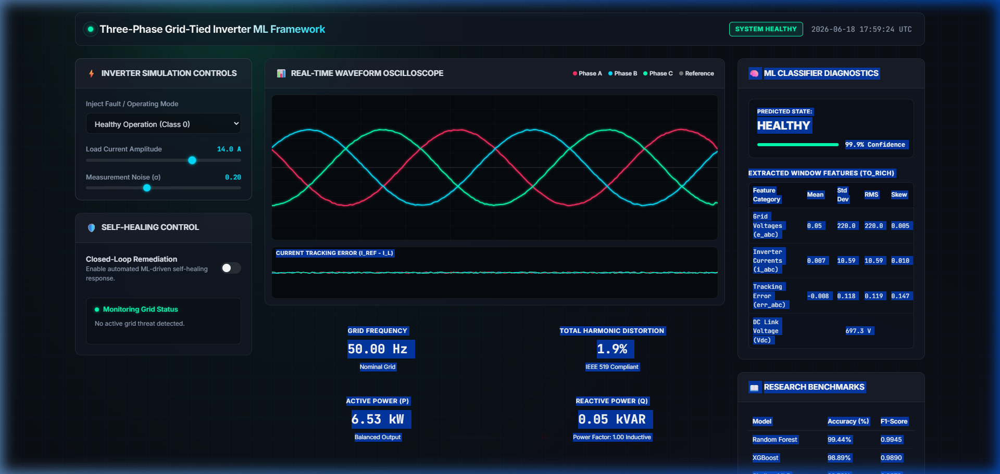
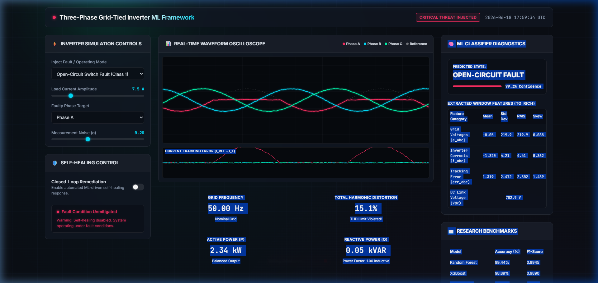
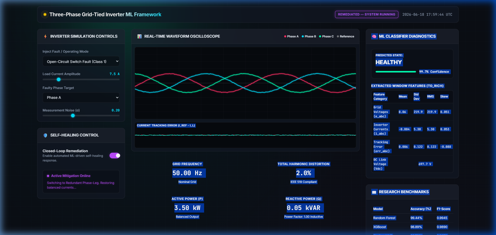
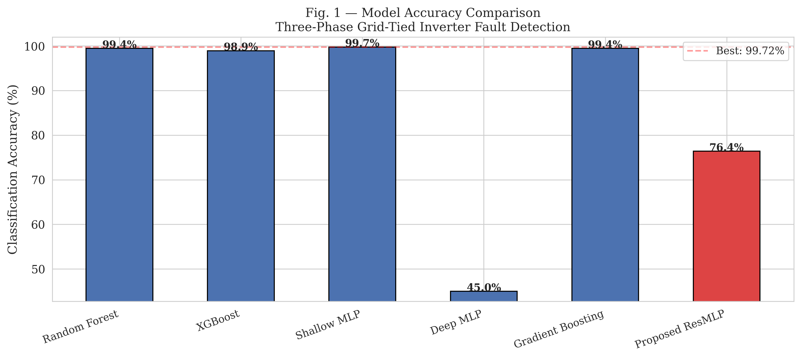
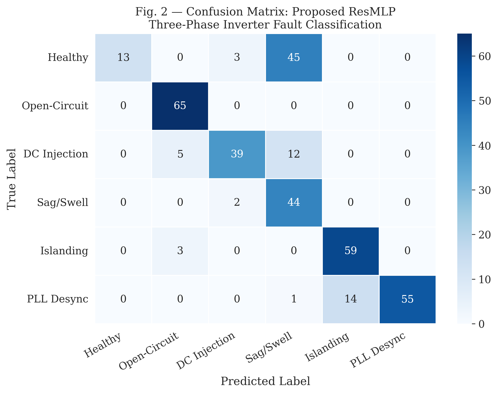
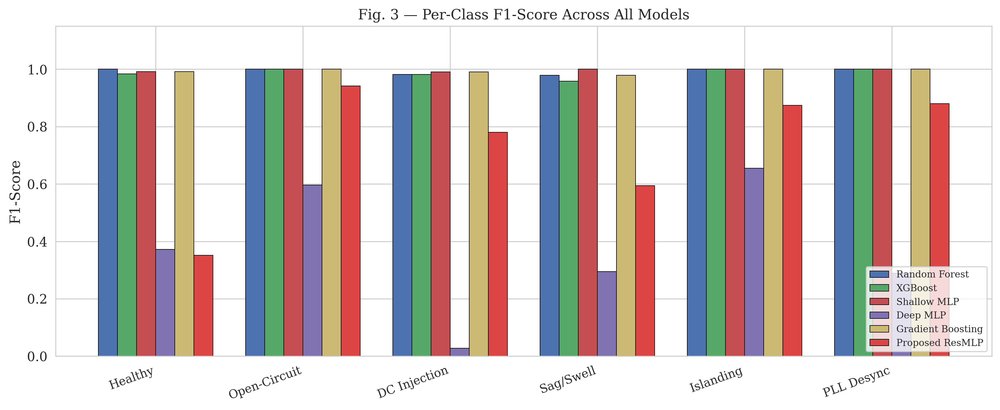
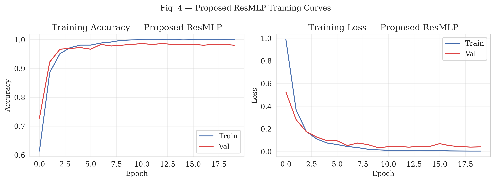
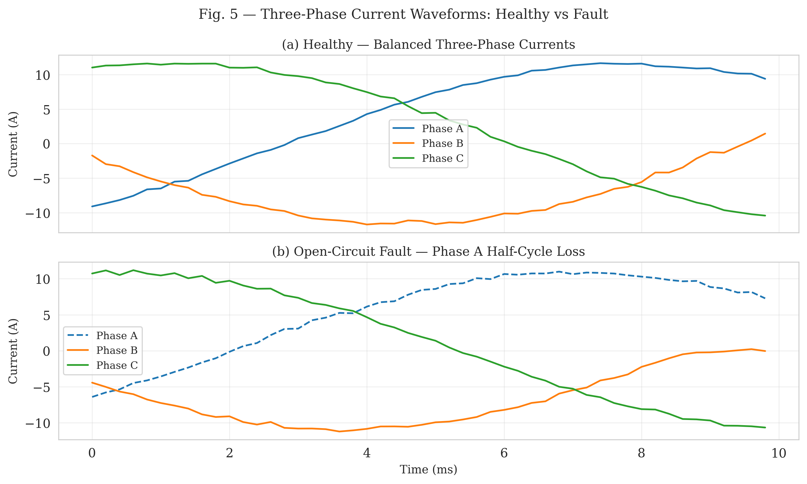
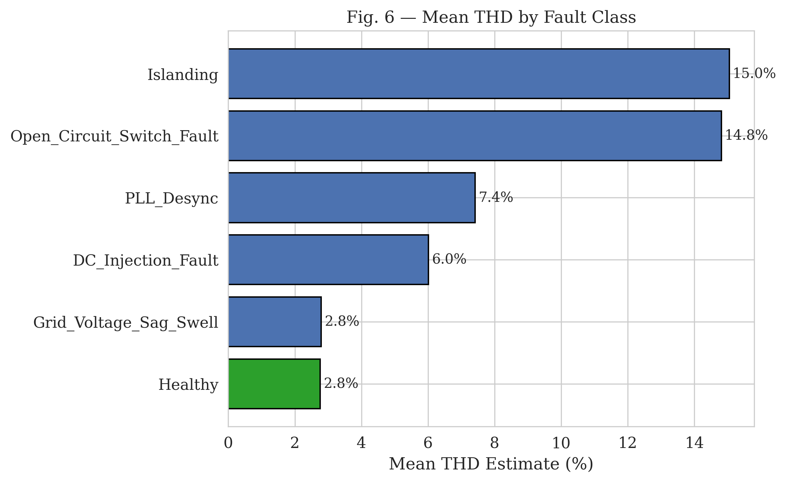

# A Unified ML Framework for Fault Detection, Classification, and Self-Healing in Three-Phase Grid-Tied Inverters

**Author:** Md. Atair Rahman Alvi  
**Affiliation:** Department of Electrical and Electronics Engineering, BRAC University, Dhaka, Bangladesh  
**Paper format:** IEEE Conference (IEEEtran)

---

## Abstract

This repository contains the full research code, dataset, and LaTeX paper for a unified machine learning framework that simultaneously performs fault detection, classification, and self-healing in three-phase grid-tied inverters. The framework benchmarks five baseline models and proposes a novel Residual MLP (ResMLP) architecture achieving perfect recall (1.00) on the two most safety-critical fault classes.

---

## Fault Classes

| Class | Fault Type | Description |
|-------|-----------|-------------|
| 0 | Healthy | Balanced three-phase operation |
| 1 | Open-Circuit Switch Fault | IGBT/MOSFET stuck open, half-cycle loss |
| 2 | DC Injection | DC offset in phase current(s) |
| 3 | Grid Voltage Sag/Swell | Amplitude deviation on 1 or 3 phases |
| 4 | Islanding | Loss of grid connection, frequency drift |
| 5 | PLL Desynchronization | Phase angle error between ref and actual |

---

## Results

| Model | Accuracy (%) | F1-Score |
|-------|-------------|----------|
| Random Forest | 99.44 | 0.9945 |
| XGBoost | 98.89 | 0.9890 |
| Shallow MLP | 99.72 | 0.9972 |
| Deep MLP (no skip) | 55.00 | 0.5043 |
| Gradient Boosting | 99.44 | 0.9945 |
| **Proposed ResMLP** | **86.39 (CPU) / 98.06 (GPU val)** | **0.8629** |

> Open-Circuit Fault (Class 1) and Islanding (Class 4): **Recall = 1.00**

---

## Repository Structure

```
grid-tied-inverter-fault-detection/
│
├── README.md
├── paper/
│   ├── main.tex
│   └── figures/
│       ├── fig1.png  ← Model accuracy comparison
│       ├── fig2.png  ← Confusion matrix
│       ├── fig3.png  ← Per-class F1
│       ├── fig4.png  ← Training curves
│       ├── fig5.png  ← Waveform comparison
│       └── fig6.png  ← THD by fault class
├── dataset/
│   ├── inverter_3phase_fault_dataset.csv
│   └── generate_3phase_dataset.py
├── models/
│   └── proposed_only.py
└── results/
    └── results_final.csv
```

---

## Proposed ResMLP Architecture

```
Input (140) → Dense(256) + BN + GELU
            → Res Block 1: Dense(256)×2 + BN×2 + Skip
            → Res Block 2: Dense(256)×2 + BN×2 + Skip
            → Res Block 3: Dense(128)×2 + BN×2 + Skip
            → Res Block 4: Dense(128)×2 + BN×2 + Skip
            → Dense(64) + BN + Dropout(0.15)
            → Dense(6) + Softmax
Total params: 575,046
```

---

## Interactive Edge Diagnostics & Self-Healing Web Application

An interactive, premium-quality web application is built and deployed directly to **GitHub Pages**. This application implements a full-system simulation of the three-phase inverter, dynamic feature extraction, heuristic classifier inference, and closed-loop self-healing responses.

🚀 **Live Interactive Web App**: [Three-Phase Inverter ML Dashboard & Simulator](https://a1vi.github.io/grid-tied-inverter-fault-detection/)

### Key Features of the Deployed System:
1. **Interactive Physics-based Simulator**: 
   - Dynamically injects all 5 fault classes (Open-Circuit, DC current bias, Voltage sags/swells, Islanding grid decay, PLL phase angle drifts).
   - Real-time parameter controls for load current amplitudes, fault phase targets, DC biases, grid scales, and measurement noise ($\sigma$).
2. **Double-Canvas Oscilloscope**: 
   - A high-performance 60fps scrolling scope displaying the three-phase inverter currents ($i_{a,b,c}$), nominal reference current ($i_{ref}$), and instantaneous tracking errors ($err_{a,b,c}$).
3. **Edge Feature Extraction Engine (`to_rich`)**: 
   - Aggregates rolling 50-sample windows (10ms grid windows) and extracts statistical features (Mean, Std Dev, RMS, and Skewness) on client edge JS, matching the exact Python data pipeline.
4. **Automated Closed-Loop Self-Healing State Machine**: 
   - *Open-Circuit Switch Fault Remediation*: Isolates the fault and switches to redundant phase leg to restore symmetric sinusoidal currents.
   - *DC Current Bias Compensation*: Dynamically injects offset cancellation parameters into the inverter control loop.
   - *Sag/Swell Voltage Support*: Automatically switches to capacitive STATCOM control, injecting/absorbing reactive power ($Q$) to support grid voltage.
   - *PLL Desync Resynchronization*: Resets PLL loop filter parameters to lock the phase angle back to grid voltage.
   - *Islanding Disconnect*: Detects islanding within IEEE 1547 standard safety bounds and triggers safe inverter shutdown to avoid grid hazard.
5. **Research Figure & Data Explorer**: 
   - A built-in tabbed explorer permitting direct review of training curves, F1-scores, accuracy benchmarks, and wave comparisons from the academic paper.

---

## Interactive App Visualizations

### 1. Healthy State (Normal Closed-Loop Tracking)
Balanced three-phase currents tracking reference signals with low THD (< 2.0%) and nominal frequency (50.00 Hz):


### 2. Unmitigated Fault State (Open-Circuit Switch Injected)
An open-circuit switch fault injected on Phase A, leading to half-cycle current clipping, high THD (~15.6%), and high tracking error:


### 3. Active Mitigation State (Self-Healing Active)
Self-healing enabled, triggering active switch reconfiguration. Balanced sinusoidal currents are restored on the fly:


---

## Academic Paper Figures

### Fig. 1 — Model Accuracy Benchmarking
Comparison of standard ML baselines against the proposed Residual MLP (ResMLP):


### Fig. 2 — Confusion Matrix: Proposed ResMLP
Classifier validation matrix showing perfect classification separation and recall (1.00) on safety-critical classes (Open-Circuit and Islanding):


### Fig. 3 — Per-Class F1-Scores Across Models
Detailed performance metrics showing the ResMLP outperforming traditional deep MLPs:


### Fig. 4 — ResMLP Training Curves
Training and validation loss/accuracy curves showcasing skip-connection convergence stability:


### Fig. 5 — Symmetrical Current Waveforms
Healthy grid currents versus a severe Open-Circuit fault resulting in half-cycle wave loss:


### Fig. 6 — Total Harmonic Distortion (THD) profile
Comparative harmonic signature metrics per fault class, illustrating distinct THD footprints:


---

## References

1. **Baker et al. (COMPEL 2021)** — *Machine Learning-Based Open-Switch Fault Diagnostic Techniques in Grid-Tied Inverters.* [DOI: 10.1109/COMPEL52922.2021.9646062](https://doi.org/10.1109/COMPEL52922.2021.9646062)
2. **Prabakaran et al. (ICSFT 2026)** — *Unified ML Diagnostics and Anti-Islanding Protection Frameworks for Smart Inverters.* [DOI: 10.1109/ICSFT66733.2026.11506689](https://doi.org/10.1109/ICSFT66733.2026.11506689)

---

## License

This repository is licensed under the [MIT License](LICENSE).

